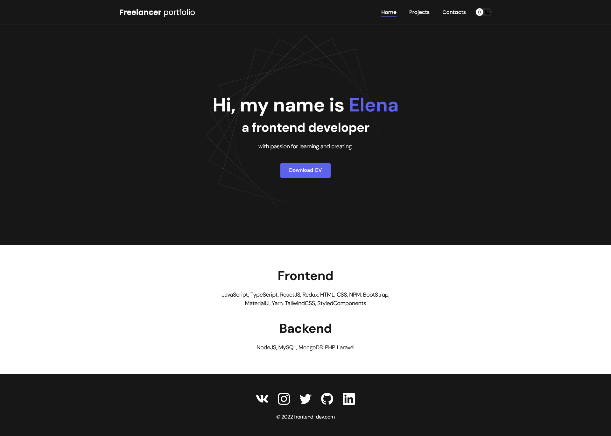
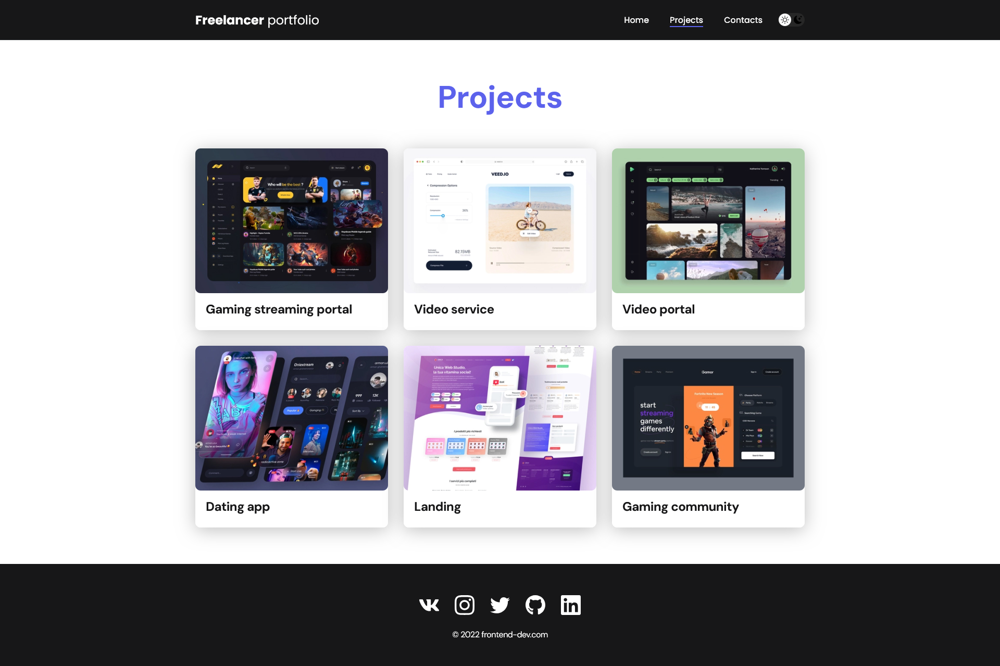

# 🌐 Personal Portfolio Website

## 📌 Overview
This is a personal portfolio website built with React.  
It serves as a digital CV showcasing projects, skills, and contact information.

The application includes multi-page navigation, light theme switching, and persistent user preferences.

## 🚀 Demo
https://aliangrey.github.io/food/

---

## 🚀 Features
- ⚛️ React-based SPA
- 🧭 Multi-page navigation (React Router DOM)
- 🌙 Dark / Light theme toggle
- 💾 Theme persistence using localStorage
- 📁 Projects showcase section
- 📄 Resume download / link
- 📱 Responsive design
- 🔗 Social media links

---

## 🛠 Tech Stack
- React
- React Router DOM
- JavaScript (ES6+)
- CSS / SCSS
- localStorage API

---

## 🎨 Features Breakdown

### 🌙 Theme Switcher
Users can switch between dark and light themes.  
The selected theme is saved in `localStorage` and persists after page reload.

### 🧭 Routing
Navigation between pages:
- Home
- Projects
- Contacts

Implemented using `react-router-dom`.

---

## 📸 Preview

```md id="img1"


```

## ⚙️ Installation
```bash
git clone https://github.com/AlianGrey/freelance-portfolio-react.git
cd portfolio
npm install
```

## ▶️ Run locally
```bash
npm start
```

## 📦 Build
```bash
npm run build
```

## 📬 Contact
GitHub: https://github.com/AlianGrey
LinkedIn: https://www.linkedin.com/in/kostrikinaelena/
Email: ek371117@gmail.com

## 📌 Notes

This project is intended as a personal portfolio and continuously evolving with new projects and improvements.